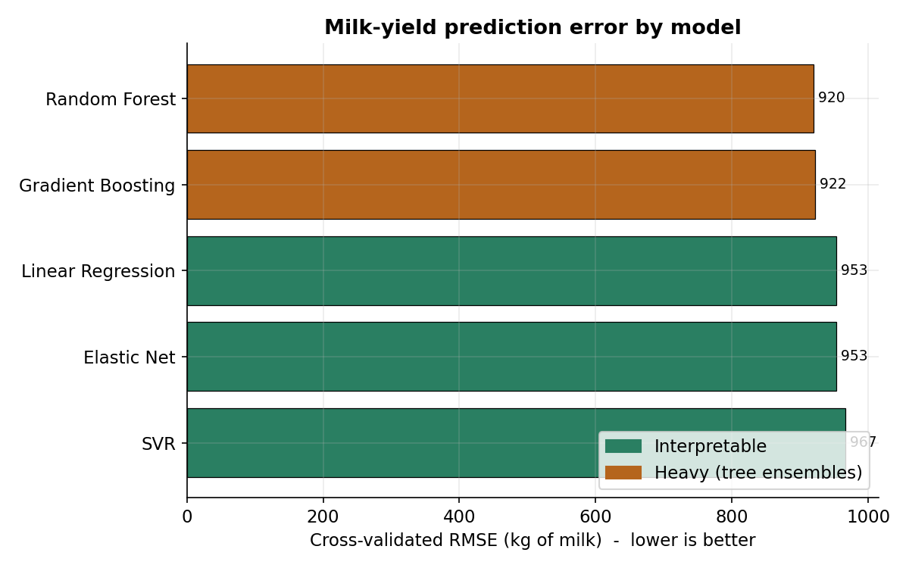
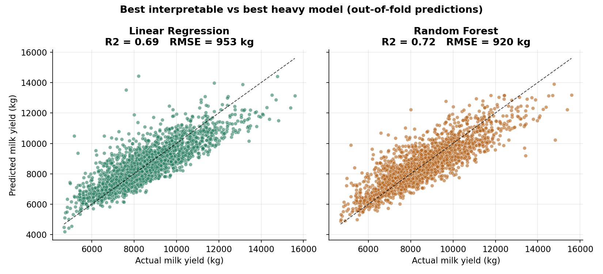
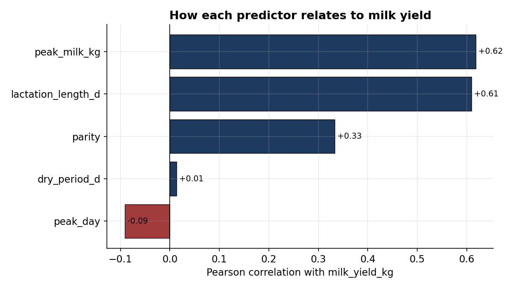

# Predicting dairy cow milk yield: do interpretable models keep up with the heavy ones?

A small, reproducible machine-learning study on Holstein-Friesian lactation
records. It asks a practical question that matters across animal science:

> On a realistic herd dataset of a few hundred records, do simple interpretable
> models (linear regression, Elastic Net, SVR) actually lose much accuracy to
> the heavier "default" choices (random forest, gradient boosting)?

The short answer in this analysis: **no, the gap is small** — which means the
interpretable model is usually the better scientific choice on data this size,
because you keep accuracy *and* get a model you can explain to a nutritionist
or a breeder.

This repository is built to be read and re-run. The full pipeline runs with one
command, the evaluation uses nested cross-validation (so the numbers are
honest), and there is a test suite.

---

## The argument in one paragraph

Most published dairy- and nutrition-ML work that gets attention uses large
sensor or herd datasets and deep models. But a great deal of real animal-science
data is small: a few dozen to a few hundred rows from one farm, one trial, or
one extracted literature table. On data that size, the flexible heavy models
have little signal to exploit and tend to converge on the same performance as a
well-regularised linear model — while being far harder to interpret and easier
to overfit. This project demonstrates that empirically on dairy lactation data
and argues for defaulting to interpretable models unless the data clearly
justifies more.

---

## Results

Run on the real dataset: **2,179 Holstein-Friesian lactation records** (after
removing 20 non-data rows that were summary statistics left in the source
sheets). Five-fold nested cross-validation.

| Model | RMSE (kg) | MAE (kg) | R² |
|---|---|---|---|
| Random Forest (heavy) | 920 | 697 | 0.716 |
| Gradient Boosting (heavy) | 922 | 697 | 0.715 |
| **Linear Regression (interpretable)** | **953** | 725 | 0.695 |
| Elastic Net (interpretable) | 953 | 726 | 0.695 |
| SVR (interpretable) | 967 | 732 | 0.686 |

**The finding:** the best heavy model beats the best interpretable model by
**33 kg of RMSE — about 3.6%.** But the honest reading needs the fold-to-fold
spread, not just the point estimate:

| Model | RMSE (kg) | per-fold mean ± SD (kg) | R² |
|---|---|---|---|
| Random Forest (heavy) | 920 | 919 ± 45 | 0.716 |
| Gradient Boosting (heavy) | 922 | 921 ± 43 | 0.715 |
| **Linear Regression (interpretable)** | **953** | 952 ± 48 | 0.695 |
| Elastic Net (interpretable) | 953 | 952 ± 48 | 0.695 |
| SVR (interpretable) | 967 | 966 ± 35 | 0.686 |

The within-model variation across folds (~±45 kg) is about the same size as the
33 kg gap between the best heavy and best interpretable model. So the gap is
small relative to the noise. However, Random Forest did win on **all 5 folds**,
so the edge is consistent, not coincidental — it is real but marginal.

**The honest conclusion:** Random Forest is consistently but only slightly
better, and on a prediction this coarse (a ~920 kg error band against an ~8,600
kg average yield) that small edge does not justify giving up the interpretability
of a linear model. On small, structured biological datasets, the interpretable
model is usually the better scientific choice — not because it is exactly as
accurate, but because it is *nearly* as accurate while staying explainable.

**Prediction error by model** (cross-validated RMSE, lower is better):



**Best interpretable vs best heavy model**, out-of-fold predictions on all
2,179 cows — the two clouds track the diagonal almost identically:



**How each predictor relates to milk yield.** Peak daily milk and lactation
length are the strongest drivers; dry-period length barely matters. This is the
kind of clear, inspectable relationship an interpretable model lets you keep and
a black box hides:



---

## Data

**Source (real data, openly licensed):**
Sarah, P., Tasrifin, D. S., Indrijani, H., & Ruswandi, D. (2024).
*Dataset for performance of superior dairy cattle sires.* Mendeley Data, v2.
CC BY 4.0. https://doi.org/10.17632/2sm93h8t7y.2

The records are Holstein-Friesian cows with milk yield, lactation length, peak
production (day and amount), and dry-period length.

**How to get it (one-time):**

```bash
python -m src.download_data      # prints the steps
```

In short: download the file from the DOI, rename it to
`data/raw/dairy_sires.csv` with the columns listed in `src/data.py`, then re-run
the analysis.

**Placeholder data:** if the real CSV is absent, the code generates a synthetic
dataset whose per-lactation means and standard deviations match the published
figures, so the repository runs end-to-end out of the box. The placeholder is
**not** real data and is watermarked on every figure and flagged in the console.
Swap in the real CSV and everything regenerates.

---

## Method

- **Models.** Three interpretable (Linear Regression, Elastic Net, RBF SVR) and
  two heavy (Random Forest, Gradient Boosting). Scale-sensitive models are
  wrapped with `StandardScaler` in a scikit-learn `Pipeline` so the comparison
  is fair.
- **Evaluation.** Nested cross-validation: an inner loop tunes hyper-parameters,
  an outer loop estimates performance. This keeps tuning separate from scoring
  so the heavy models are not flattered by leakage — the single most common
  mistake in small-data model comparisons.
- **Metrics.** RMSE and MAE (both in kg of milk) and R².

---

## Run it

```bash
# 1. install
pip install -r requirements.txt

# 2. (optional) get the real data; otherwise a placeholder is used
python -m src.download_data

# 3. run the full analysis -> prints a results table, writes figures + metrics
python -m src.run_analysis

# 4. run the tests
pytest -q
```

Outputs land in `results/metrics/model_results.csv` and
`results/figures/*.png`.

---

## Repository layout

```
dairy-yield-ml/
├── src/
│   ├── data.py            # load real CSV or build the labelled placeholder
│   ├── models.py          # the five models + hyper-parameter grids
│   ├── evaluate.py        # nested cross-validation + metrics
│   ├── plots.py           # the three figures
│   ├── run_analysis.py    # entry point: runs everything
│   └── download_data.py   # how to obtain the real dataset
├── notebooks/
│   └── walkthrough.ipynb  # narrated version of the same analysis
├── tests/
│   └── test_pipeline.py   # data, model, metric, and end-to-end tests
├── results/               # generated metrics and figures
├── docs/img/              # figures shown in this README
├── requirements.txt
├── LICENSE                # MIT (code)
└── README.md
```

---

## Notes and honest limitations

- Results are produced on the real dataset (2,179 cows). The data-cleaning step
  removes 20 rows that were summary statistics ("Standard of Deviation",
  "Maximum", etc.) accidentally left in the source spreadsheet's data range;
  this is documented in `src/data.py`.
- The dataset ships with the repository as a placeholder generator *and* loads
  the real CSV when present, so the pipeline always runs out of the box.
- With five predictors, R² around 0.70 is a sensible ceiling — peak yield and
  lactation length carry most of the signal, which is biologically expected.
- Code is MIT-licensed. The dataset is CC BY 4.0; please cite the original
  authors (citation above) if you reuse it.

---

## Author

**Md Raihan Patwary** — MS researcher, Animal Nutrition, Bangladesh Agricultural
University. Interests: chemometrics, applied machine learning for nutrition and
feed science, and interpretable modelling on small biological datasets.
